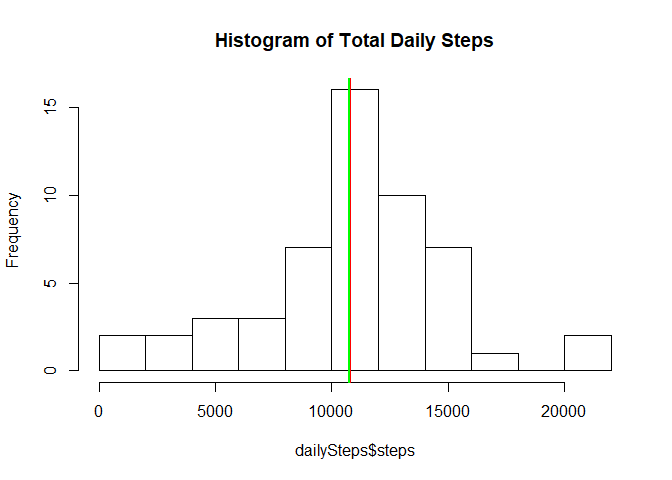
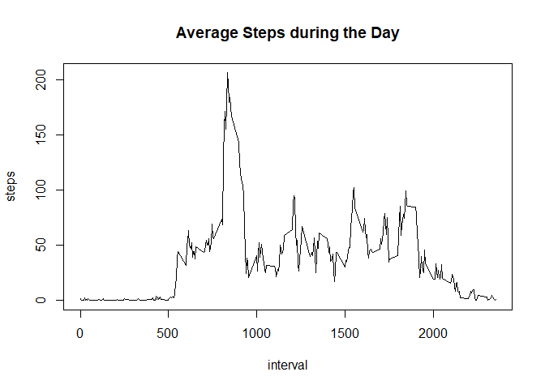
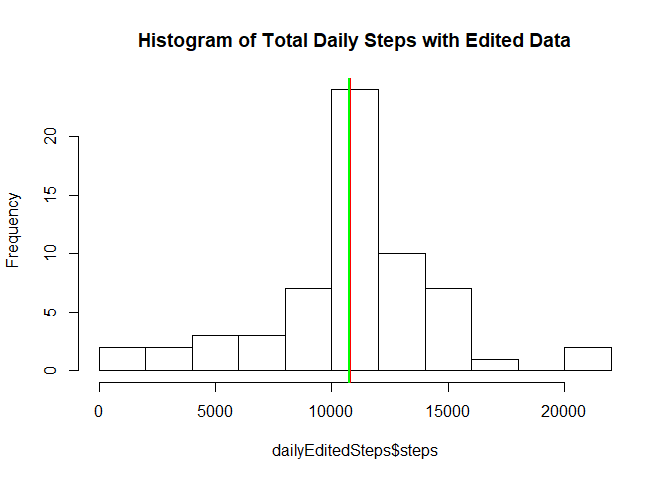
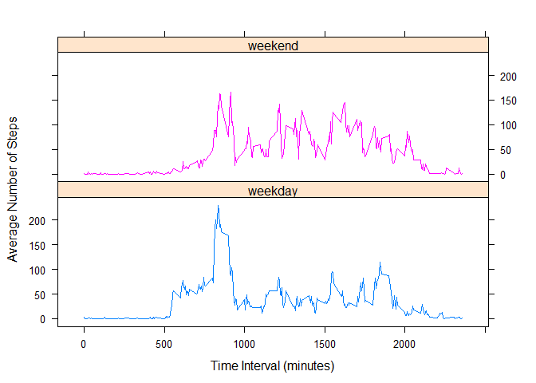

## Loading and preprocessing the data

After unzipping the activity.zip file in order to extract the csv with the raw data, read the data into a data frame and format the dates to make them date objects instead of strings.  Next get a clean version of the data with no missing values by removing any NAs in the data.


```r
rawData <- read.csv("activity.csv")
rawData$date <- as.Date(rawData$date, "%Y-%m-%d")
activityClean <- subset(rawData, !is.na(steps))
```

## What is mean total number of steps taken per day?

First we use the clean version of the data to calculate the total steps taken per day.  Then we plot the data in a histogram to get a visual of the distribution of the total steps per day in the data.  Next we calculate the mean and the median for the total number of steps per day and add those lines to the histogram.  The mean and median total daily steps are very close to each other, at 10,766.19 and 10765 respectively.


```r
dailySteps <- aggregate(steps ~ date, data = activityClean, FUN = sum)
hist(dailySteps$steps, breaks = 10, main = "Histogram of Total Daily Steps")
meanDaily <- mean(dailySteps$steps)
meanDaily
```

```
## [1] 10766.19
```

```r
medianDaily <- median(dailySteps$steps)
medianDaily
```

```
## [1] 10765
```

```r
abline(v=meanDaily, col = "red", lwd = 3)
abline(v=medianDaily, col = "green", lwd = 2)
```

<!-- -->

## What is the average daily activity pattern?

We take the clean version of the data and average the number of steps across the 5-minute data collection intervals.  We then use this data to create a time series plot that shows the daily average steps per 5-minute interval.  The interval with the maximum average steps is 835, with an average of 206.17 steps.


```r
intervalSteps <- aggregate(steps ~ interval, data = activityClean, FUN = mean)
with(intervalSteps, plot(interval, steps, type = "l"))
title(main = "Average Steps during the Day")
```

<!-- -->

```r
maxSteps <- max(intervalSteps$steps)
maxStepsInterval <- intervalSteps[intervalSteps$steps == maxSteps,]
maxStepsInterval
```

```
##     interval    steps
## 104      835 206.1698
```

## Imputing missing values

This dataset does have a number of NAs which are likely influencing the results of the analysis.  To take a closer look at this we go back to the original dataset and figure out exactly how many NAs there really are.  It looks like out of 17,568 observations, 2,304 are NAs instead of actual data.  That's a little over 13% of the data that wasn't used in the previous analysis.  In an effort to improve the analysis, we will create a dataset where we replace NA values with the mean for that interval.  Now we recreate the histogram we did earlier on total daily steps and see what filling in the NA values has changed.  The histogram has changed slightly, but the mean and median have ended up pretty much the same, which makes sense, as the NAs were not included in earlier calculations, and we used mean values to fill the empty data.  So it is unsurprising that the histogram shows some changes in the frequency of certain totals, but the overall mean and median barely shift.


```r
naTotal <- sum(is.na(rawData$steps))
naTotal
```

```
## [1] 2304
```

```r
colnames(intervalSteps) <- c("interval", "meanSteps")
editedData <- merge(x = rawData, y = intervalSteps, by = "interval")
editedData$steps <- ifelse(is.na(editedData$steps), editedData$meanSteps, editedData$steps)

dailyEditedSteps <- aggregate(steps ~ date, data = editedData, FUN = sum)
hist(dailyEditedSteps$steps, breaks = 10, main = "Histogram of Total Daily Steps with Edited Data")
meanEditedDaily <- mean(dailyEditedSteps$steps)
meanEditedDaily
```

```
## [1] 10766.19
```

```r
medianEditedDaily <- median(dailyEditedSteps$steps)
medianEditedDaily
```

```
## [1] 10766.19
```

```r
abline(v=meanEditedDaily, col = "red", lwd = 3)
abline(v=medianEditedDaily, col = "green", lwd = 2)
```

<!-- -->

## Are there differences in activity patterns between weekdays and weekends?

First we must determine which days are weekdays and which are on the weekend.  Once we have added that indicator to the data, we can compare the plots of the average steps per time interval for the days during the week and the days during the weekend.  On the weekend it looks like there are more steps on average in the middle of the day, but there are no consistent extremes like there is in the morning on weekdays.


```r
editedData$day <- ifelse(weekdays(editedData$date) == "Saturday" | weekdays(editedData$date) == "Sunday", "weekend", "weekday")
intervalEditedSteps <- aggregate(steps ~ interval + day, data = editedData, FUN = mean)
library(lattice)
xyplot(intervalEditedSteps$steps ~ intervalEditedSteps$interval | intervalEditedSteps$day, group = intervalEditedSteps$day, type = "l", xlab = "Time Interval (minutes)", ylab = "Average Number of Steps", layout = c(1,2))
```

<!-- -->
